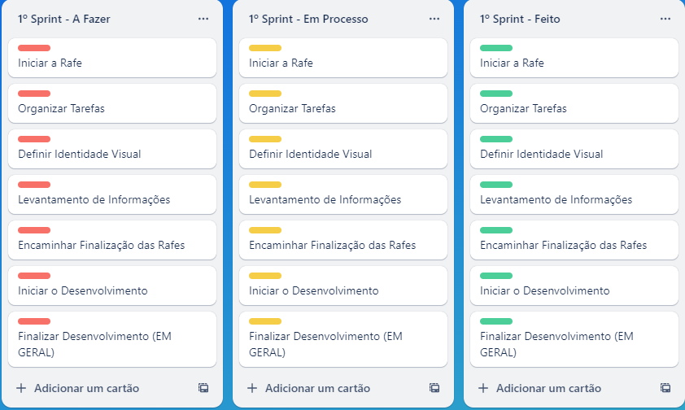

**COMENTÁRIOS NO CÓDIGO MUITO EXPLICATIVOS SE ENCONTRAM NOS ARQUIVOS DA HOME**
**COMENTÁRIOS NO CÓDIGO MUITO EXPLICATIVOS SE ENCONTRAM NOS ARQUIVOS DA HOME**
**COMENTÁRIOS NO CÓDIGO MUITO EXPLICATIVOS SE ENCONTRAM NOS ARQUIVOS DA HOME**

**LINK DO FIGMA PARA COMPARAÇÃO DE TELAS**
https://www.figma.com/file/ecreZwFxynr47nNfnbdwZx/PetGriffe?type=design&node-id=0%3A1&mode=design&t=EwYKy4nsjAP3dPQz-1

----- HOME -----

#### HTML

Seções Principais:
Navbar: Contém a navegação do site, incluindo links para login, cadastro, serviços pet e diferentes seções para animais.

Pop-ups: Dois pop-ups são usados, um para cadastrar o endereço e outro para informações do cartão de crédito.

Carrossel de Imagens: Exibe várias imagens com botões para navegar entre elas.

Seção de Categorias: Apresenta diferentes categorias de animais, cada uma com um link para uma seção específica do site.

Seção de Cards de Produtos: Exibe produtos (rações e petiscos) em um slider horizontal para exibir vários produtos.

Footer: Contém informações adicionais, links para política de privacidade, termos de serviço, redes sociais e informações de direitos autorais.

Arquivos Externos:
home.css: Arquivo de estilo para a página inicial.
home.js: Arquivo JavaScript que manipula os elementos da página, incluindo a funcionalidade dos pop-ups, carrossel de imagens, interações do carrinho de compras etc.

Funcionalidades Específicas:
Pop-ups: Utilizam JavaScript para exibir e ocultar os pop-ups, permitindo o preenchimento de informações de endereço e dados do cartão.
Carrossel de Imagens: Usa JavaScript para permitir a navegação entre imagens clicando nos botões de seta.
Cards de Produtos: Utiliza um slider horizontal para exibir vários produtos em um espaço limitado, com botões para mover entre eles.

Considerações Finais:
Este documento HTML forma a estrutura básica de uma página web para o site PetGriffe. Ele utiliza HTML para estruturar o conteúdo, CSS para estilização e JavaScript para interatividade. Cada seção tem sua função específica, e os arquivos externos são referenciados para implementar estilos e funcionalidades adicionais.

#### JAVASCRIPT

### Carrossel de Imagens

1. **Variável 'contar'**: Controla o slide atual do carrossel, iniciando em 1.

2. **Função 'mudarImagem(next)'**: Recebe um parâmetro 'next' que indica se o slide deve avançar ou retroceder. Gerencia a transição de slides e a seleção do botão de rádio correspondente para exibir a imagem correta.

### Carrinho de Compras

1. **Variável 'carrinhoAberto'**: Controla se o carrinho está aberto ou fechado.

2. **Funções 'toggleCarrinho()' e 'fecharCarrinho()'**: Controlam a abertura e o fechamento do carrinho de compras, respectivamente. 'toggleCarrinho()' também gerencia o scroll da página quando o carrinho é aberto ou fechado.

3. **Variável 'carrinhoDeCompras' e funções relacionadas**: Permitem adicionar produtos ao carrinho, atualizar a exibição dinâmica do carrinho na página e finalizar a compra, mostrando um alerta ao finalizar ou se o carrinho estiver vazio.

### Consulta de Endereço por CEP

1. **Consulta de CEP utilizando a API ViaCEP**: Ao digitar um CEP válido e sair do campo, realiza uma consulta assíncrona para obter informações de endereço (logradouro, bairro, cidade) e exibe esses dados nos campos correspondentes do formulário.

### Menu Hamburger

1. **Funções 'toggleMenu()' e 'fecharMenu()'**: Controlam a exibição e o fechamento do menu hamburger, alterando a posição do menu na tela. Também gerenciam o scroll da página quando o menu é aberto ou fechado.

### Carrossel de Cards

1. **Funcionalidade para múltiplos carrosséis de cards**: Implementa a funcionalidade de um carrossel de cards genérico que pode ser replicado para vários elementos da página. Ele detecta a largura do contêiner e ajusta a exibição dos slides conforme a largura, permitindo navegar entre os cards.

---

----- CACHORRO -----

#### HTML

**Estrutura Básica da Página HTML**
O código HTML começa com a definição do documento, incluindo meta tags para o charset, viewport e links para folhas de estilo (CSS) e fontes do Google Fonts. A estrutura da página inclui uma barra de navegação (navbar), um menu hamburger, um ícone da empresa, uma barra de busca, links de login/cadastro, um carrinho de compras e seções de pop-ups para informações de endereço e detalhes do cartão de crédito.

**Funcionalidades JavaScript para Pop-ups**
Existem dois pop-ups (meuPopup e cartaoPopup) que são exibidos e ocultados com base em eventos de clique nos botões "Avançar Compra" e "Finalizar Compra", respectivamente.
Quando o botão "Avançar Etapa" é clicado no primeiro pop-up, o código esconde o primeiro pop-up e exibe o segundo pop-up para informações do cartão de crédito.
No segundo pop-up, o botão "Finalizar Compra" verifica se há itens no carrinho antes de concluir a compra. Se o carrinho estiver vazio, exibe um alerta; caso contrário, simula uma compra (exibindo um alerta de "Compra finalizada"), esvazia o carrinho e fecha os pop-ups.

**Seção de Banner e Cards de Produtos**
Há uma seção de banner "Cachorro" definida com um título.
A seção de cards de produtos é composta por vários carrosséis (slider) que exibe produtos para cachorros.
Cada card de produto contém uma imagem, título, preço e botão "Comprar". O carrossel possui botões para navegar entre os produtos (esquerda/direita).

**JavaScript para o Carrossel de Produtos**
O código JavaScript controla o funcionamento do carrossel de produtos, permitindo a navegação entre os slides para exibir diferentes produtos.
Existem funções para mover o carrossel para a esquerda (slideLeft1()) e para a direita (slideRight1()), permitindo a transição entre os produtos exibidos.

#### JAVASCRIPT

### Carrinho de Compras

1. **Variável 'carrinhoAberto'**: Controla se o carrinho está aberto ou fechado.

2. **Funções 'toggleCarrinho()' e 'fecharCarrinho()'**: Controlam a abertura e o fechamento do carrinho de compras, respectivamente. 'toggleCarrinho()' também gerencia o scroll da página quando o carrinho é aberto ou fechado.

3. **Variável 'carrinhoDeCompras' e funções relacionadas**: Permitem adicionar produtos ao carrinho, atualizar a exibição dinâmica do carrinho na página e finalizar a compra, mostrando um alerta ao finalizar ou se o carrinho estiver vazio.

### Consulta de Endereço por CEP

1. **Consulta de CEP utilizando a API ViaCEP**: Ao digitar um CEP válido e sair do campo, realiza uma consulta assíncrona para obter informações de endereço (logradouro, bairro, cidade) e exibe esses dados nos campos correspondentes do formulário.

### Menu Hamburger

1. **Funções 'toggleMenu()' e 'fecharMenu()'**: Controlam a exibição e o fechamento do menu hamburger, alterando a posição do menu na tela. Também gerenciam o scroll da página quando o menu é aberto ou fechado.

### Carrossel de Cards

1. **Funcionalidade para múltiplos carrosséis de cards**: Implementa a funcionalidade de um carrossel de cards genérico que pode ser replicado para vários elementos da página. Ele detecta a largura do contêiner e ajusta a exibição dos slides conforme a largura, permitindo navegar entre os cards.

---

----- GATO -----

#### HTML

**Estrutura Básica da Página HTML**
O código HTML começa com a definição do documento, incluindo meta tags para o charset, viewport e links para folhas de estilo (CSS) e fontes do Google Fonts. A estrutura da página inclui uma barra de navegação (navbar), um menu hamburger, um ícone da empresa, uma barra de busca, links de login/cadastro, um carrinho de compras e seções de pop-ups para informações de endereço e detalhes do cartão de crédito.

**Funcionalidades JavaScript para Pop-ups**
Existem dois pop-ups (meuPopup e cartaoPopup) que são exibidos e ocultados com base em eventos de clique nos botões "Avançar Compra" e "Finalizar Compra", respectivamente.
Quando o botão "Avançar Etapa" é clicado no primeiro pop-up, o código esconde o primeiro pop-up e exibe o segundo pop-up para informações do cartão de crédito.
No segundo pop-up, o botão "Finalizar Compra" verifica se há itens no carrinho antes de concluir a compra. Se o carrinho estiver vazio, exibe um alerta; caso contrário, simula uma compra (exibindo um alerta de "Compra finalizada"), esvazia o carrinho e fecha os pop-ups.

**Seção de Banner e Cards de Produtos**
Há uma seção de banner "Cachorro" definida com um título.
A seção de cards de produtos é composta por vários carrosséis (slider) que exibe produtos para gatos.
Cada card de produto contém uma imagem, título, preço e botão "Comprar". O carrossel possui botões para navegar entre os produtos (esquerda/direita).

**JavaScript para o Carrossel de Produtos**
O código JavaScript controla o funcionamento do carrossel de produtos, permitindo a navegação entre os slides para exibir diferentes produtos.
Existem funções para mover o carrossel para a esquerda (slideLeft1()) e para a direita (slideRight1()), permitindo a transição entre os produtos exibidos.

#### JAVASCRIPT

### Carrinho de Compras

1. **Variável 'carrinhoAberto'**: Controla se o carrinho está aberto ou fechado.

2. **Funções 'toggleCarrinho()' e 'fecharCarrinho()'**: Controlam a abertura e o fechamento do carrinho de compras, respectivamente. 'toggleCarrinho()' também gerencia o scroll da página quando o carrinho é aberto ou fechado.

3. **Variável 'carrinhoDeCompras' e funções relacionadas**: Permitem adicionar produtos ao carrinho, atualizar a exibição dinâmica do carrinho na página e finalizar a compra, mostrando um alerta ao finalizar ou se o carrinho estiver vazio.

### Consulta de Endereço por CEP

1. **Consulta de CEP utilizando a API ViaCEP**: Ao digitar um CEP válido e sair do campo, realiza uma consulta assíncrona para obter informações de endereço (logradouro, bairro, cidade) e exibe esses dados nos campos correspondentes do formulário.

### Menu Hamburger

1. **Funções 'toggleMenu()' e 'fecharMenu()'**: Controlam a exibição e o fechamento do menu hamburger, alterando a posição do menu na tela. Também gerenciam o scroll da página quando o menu é aberto ou fechado.

### Carrossel de Cards

1. **Funcionalidade para múltiplos carrosséis de cards**: Implementa a funcionalidade de um carrossel de cards genérico que pode ser replicado para vários elementos da página. Ele detecta a largura do contêiner e ajusta a exibição dos slides conforme a largura, permitindo navegar entre os cards.

---

----- PÁSSARO -----

#### HTML

**Estrutura Básica da Página HTML**
O código HTML começa com a definição do documento, incluindo meta tags para o charset, viewport e links para folhas de estilo (CSS) e fontes do Google Fonts. A estrutura da página inclui uma barra de navegação (navbar), um menu hamburger, um ícone da empresa, uma barra de busca, links de login/cadastro, um carrinho de compras e seções de pop-ups para informações de endereço e detalhes do cartão de crédito.

**Funcionalidades JavaScript para Pop-ups**
Existem dois pop-ups (meuPopup e cartaoPopup) que são exibidos e ocultados com base em eventos de clique nos botões "Avançar Compra" e "Finalizar Compra", respectivamente.
Quando o botão "Avançar Etapa" é clicado no primeiro pop-up, o código esconde o primeiro pop-up e exibe o segundo pop-up para informações do cartão de crédito.
No segundo pop-up, o botão "Finalizar Compra" verifica se há itens no carrinho antes de concluir a compra. Se o carrinho estiver vazio, exibe um alerta; caso contrário, simula uma compra (exibindo um alerta de "Compra finalizada"), esvazia o carrinho e fecha os pop-ups.

**Seção de Banner e Cards de Produtos**
Há uma seção de banner "Cachorro" definida com um título.
A seção de cards de produtos é composta por vários carrosséis (slider) que exibe produtos para pássaros.
Cada card de produto contém uma imagem, título, preço e botão "Comprar". O carrossel possui botões para navegar entre os produtos (esquerda/direita).

**JavaScript para o Carrossel de Produtos**
O código JavaScript controla o funcionamento do carrossel de produtos, permitindo a navegação entre os slides para exibir diferentes produtos.
Existem funções para mover o carrossel para a esquerda (slideLeft1()) e para a direita (slideRight1()), permitindo a transição entre os produtos exibidos.

#### JAVASCRIPT

### Carrinho de Compras

1. **Variável 'carrinhoAberto'**: Controla se o carrinho está aberto ou fechado.

2. **Funções 'toggleCarrinho()' e 'fecharCarrinho()'**: Controlam a abertura e o fechamento do carrinho de compras, respectivamente. 'toggleCarrinho()' também gerencia o scroll da página quando o carrinho é aberto ou fechado.

3. **Variável 'carrinhoDeCompras' e funções relacionadas**: Permitem adicionar produtos ao carrinho, atualizar a exibição dinâmica do carrinho na página e finalizar a compra, mostrando um alerta ao finalizar ou se o carrinho estiver vazio.

### Consulta de Endereço por CEP

1. **Consulta de CEP utilizando a API ViaCEP**: Ao digitar um CEP válido e sair do campo, realiza uma consulta assíncrona para obter informações de endereço (logradouro, bairro, cidade) e exibe esses dados nos campos correspondentes do formulário.

### Menu Hamburger

1. **Funções 'toggleMenu()' e 'fecharMenu()'**: Controlam a exibição e o fechamento do menu hamburger, alterando a posição do menu na tela. Também gerenciam o scroll da página quando o menu é aberto ou fechado.

### Carrossel de Cards

1. **Funcionalidade para múltiplos carrosséis de cards**: Implementa a funcionalidade de um carrossel de cards genérico que pode ser replicado para vários elementos da página. Ele detecta a largura do contêiner e ajusta a exibição dos slides conforme a largura, permitindo navegar entre os cards.

---

---- FORMULÁRIOS ----

**Seção de Cadastro**

: Define uma seção para o formulário de cadastro.

: Uma área reservada para exibir uma imagem relacionada ao cadastro.
: Exibe uma imagem associada ao processo de cadastro.

: Agrupa os campos de formulário.

: Cada div representa um conjunto de campos de formulário.
label: Rótulos para os campos de entrada.
input: Campos de entrada para informações como nome de usuário, email, senha, CPF, CEP e número residencial.

: Uma área separada para o botão de envio do formulário de cadastro.
input type="submit": Botão para enviar os dados do formulário.

**Seção de Login**

: Define uma seção para o formulário de login.

: Uma seção para exibir uma imagem relacionada ao login.
: Exibe uma imagem associada ao login.

: Uma área para o formulário de login.
<label for="lnome">Nome de Usuário</label>: Rótulo para o campo de entrada do nome de usuário.
<input type="text" id="lnome" name="nome" placeholder="Insira seu username">: Campo de entrada para o nome de usuário, com um espaço reservado (placeholder) para instruir o usuário sobre o que inserir.
<label for="lsenha">Senha</label>: Rótulo para o campo de entrada da senha.
<input type="text" id="lsenha" name="senha" placeholder="Insira sua senha">: Campo de entrada para a senha, também com um espaço reservado para orientação.

: Uma área para o botão de envio do formulário.
<input type="submit" id="lenviar" name="enviar">: Botão de envio que pode ser clicado para enviar os dados do formulário.

**Seção de Agendamento**

: Define uma seção para o formulário de agendamento.

: Contém informações e títulos relacionados ao agendamento.

: Exibe um ícone associado ao serviço de agendamento.

: Título principal "Solicite um Serviço!".

: Mensagem informativa sobre o serviço de agendamento.

: Contém o formulário para as opções de agendamento.
<form action="">: Formulário que será enviado para o destino especificado no atributo action.
Campos de seleção e preenchimento para escolher o tipo de agendamento, horário, data, número de telefone, email e observações.
Botão "Enviar" para submeter o formulário.

-----------------------------------------------------------

**CRONOGRAMA**

- O cronograma seguido foi o do próprio documento utilizado pelos professores

Semana 1 (16/10/2023 - 20/10/2023): Preparação e Requisitos
Definição do escopo do projeto.
Levantamento de requisitos detalhados.
Criação de uma lista de tarefas.

Semana 2 (23/10/2023 - 27/10/2023): Sprint 1 - Front-end Inicial
Início do desenvolvimento do front-end.
Estruturação do layout do site.
Criação das páginas iniciais.

Semana 3 (30/10/2023 - 01/11/2023): 
Início do desenvolvimento do back-end.
Implementação do banco de dados básico.
Desenvolvimento das funções de autenticação.

Semana 4 (06/11/2023 - 10/11/2023): Sprint 2 - Front-end Intermediário e Back-End Inicial
Continuação do desenvolvimento do front-end.
Adição de recursos de catálogo de produtos.
Implementação de páginas de serviços.

Semana 5 (13/11/2023 - 17/11/2023): 
Continuação do desenvolvimento do back-end.
Implementação de recursos de agendamento.
Desenvolvimento do sistema de registro de usuários.

Semana 6 (21/11/2023 - 24/11/2023): Sprint 3 - Integração de Dados
Integração do front-end e back-end.
Teste de integração de dados e funcionalidades.
Ajustes e correções.

Semana 7 (27/11/2023 - 01/12/2023): 
Refinamento do design e da usabilidade.
Realização de testes de usabilidade.
Correções e otimizações.

Semana 8 (04/12/2023 - 08/12/2023): Sprint Final e Preparação para Apresentação
Finalização do desenvolvimento.
Preparação para a apresentação.
Documentação do projeto.

Semana 9 (11/12/2023 - 15/12/2023): Apresentação e Entrega
Apresentação do site completo.
Demonstração das funcionalidades.
Entrega do projeto ao cliente ou instrutor.
Avaliação final.

**METODOLOGIA DE DESENVOLVIMENTO**

- Metodologia utilizada foi Kanban, imagem ilustrativa logo abaixo

**Briefing e Decisões de Design**

Visão Geral:
A PetGriffe é um estabelecimento direcionado a vendas de produtos e serviços para cachorros, gatos e aves não exóticas. Buscamos proporcionar o melhor ambiente possível e soluções de alta qualidade aos animais de estimação dos donos.

Missão:
Nossa missão é fornecer produtos e serviços excepcionais que promovam a saúde, o bem-estar e a felicidade de animais de estimação, nos tornando um destino preferido para proprietários de animais nas regiões de Americana e Limeira.

-- FICTÍCIO --
Localização:
1 - Loja e Clínica:
Av. Tiradentes, 200  - Centro
Limeira - SP
2 - Loja e Clínica:
Av. Brasil, 1770 - Vila Frezzarin
Americana – SP

Informações gerais:
1. Nome:
PetGriffe
2. Públco-Alvo:
Proprietários de cachorros, gatos e aves

Design e Estilo:
Identidade Visual:
Cores: Azul (puxado para o verde água), cores neutras e claras, laranja em alguns detalhes

Logo: Coração com um cachorro e um gato.

Fonte: Uma fonte simples sem serifs ou muitos ornamentos.

Estilo e Atmosfera:
Um lugar simples, acolhedor e tranquilo que remeta a felicidade.

-------------------------------------------------------

Documentar projetos é fundamental por várias razões:

### Clareza e Compreensão

1. **Facilita a compreensão:** Documentação clara e detalhada ajuda os membros da equipe e pessoas de fora a entenderem o propósito, funcionamento e estrutura do projeto.

2. **Acelera o processo de aprendizado:** Novos membros da equipe podem aprender mais rapidamente sobre o projeto, suas funcionalidades e processos através de uma documentação bem elaborada.

### Comunicação Eficaz

3. **Melhora a comunicação:** Permite uma comunicação mais eficaz entre os membros da equipe, clientes e qualquer pessoa envolvida no projeto.

4. **Evita mal-entendidos:** Ajuda a evitar mal-entendidos e interpretações errôneas, garantindo que todos tenham a mesma compreensão do projeto.

### Transferência de Conhecimento

5. **Suporte à continuidade do projeto:** Ajuda na continuidade do projeto, mesmo que membros da equipe mudem ou saiam.

### Boas Práticas

6. **Melhora a qualidade do trabalho:** É uma prática recomendada para melhorar a qualidade do trabalho e promover boas práticas de desenvolvimento.

Em resumo, a documentação em projetos é crucial para garantir a compreensão, comunicação eficaz, manutenção adequada, transferência de conhecimento e qualidade do trabalho. Ela serve como um registro detalhado do projeto, permitindo seu entendimento e evolução ao longo do tempo.
